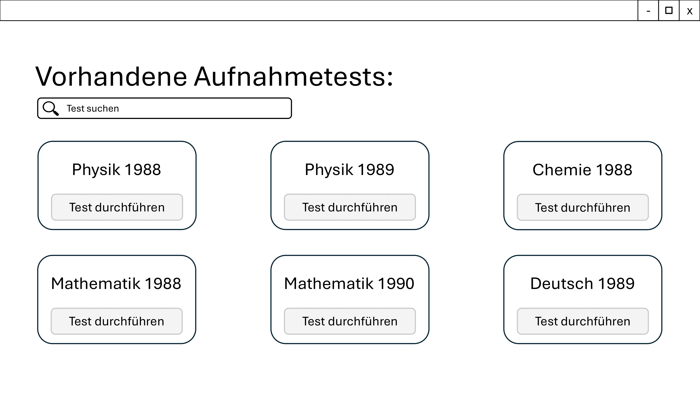
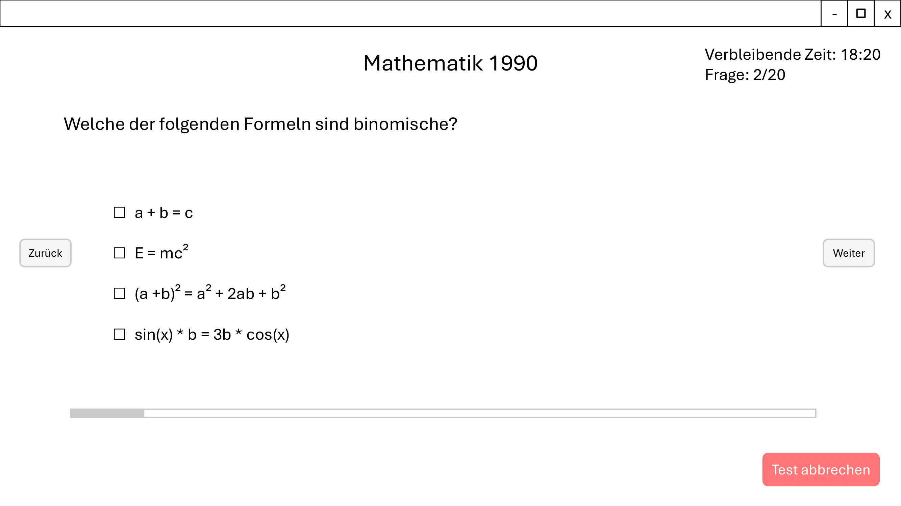
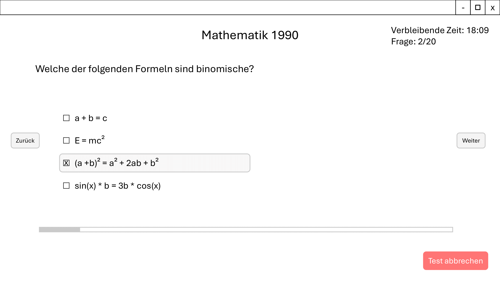
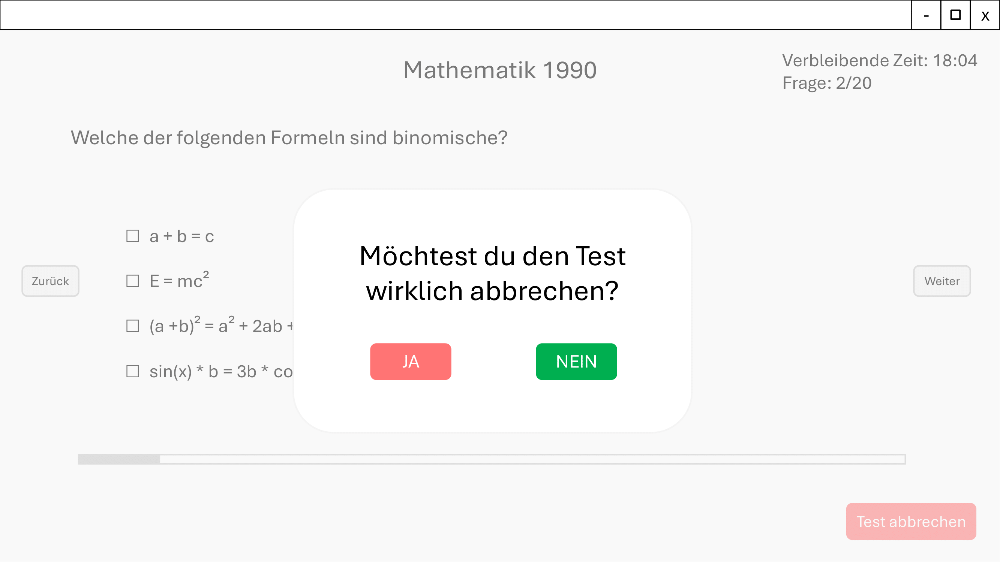
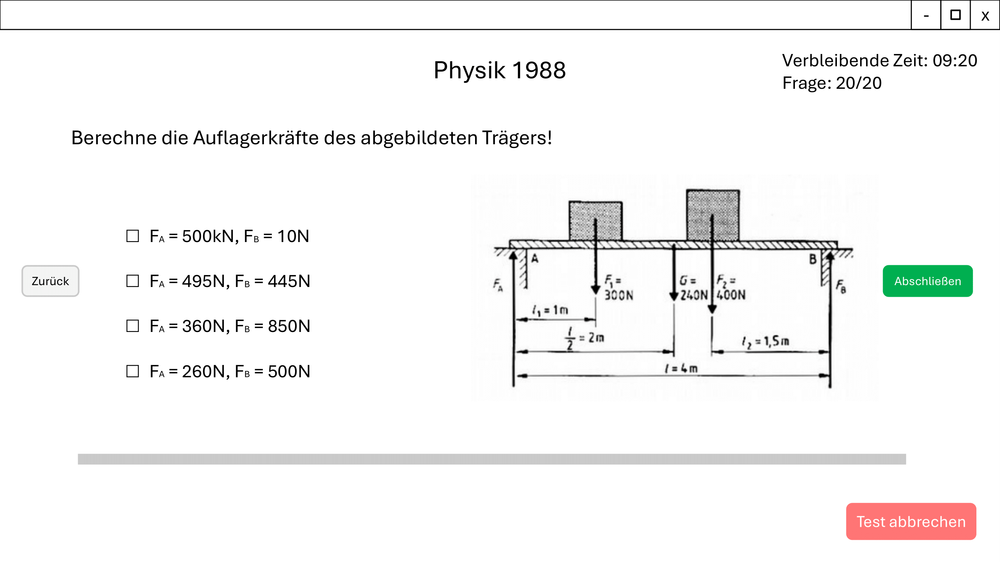
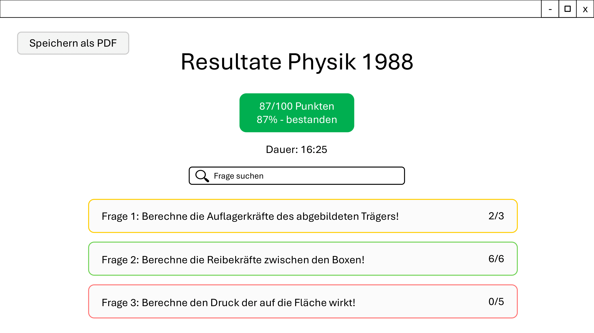
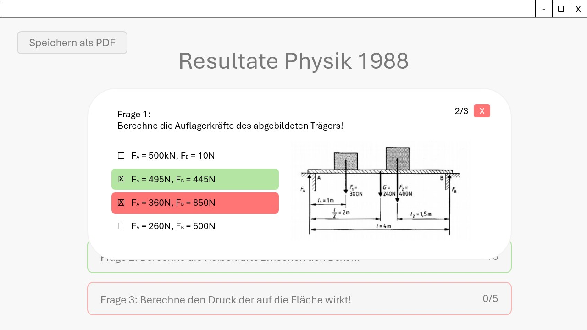
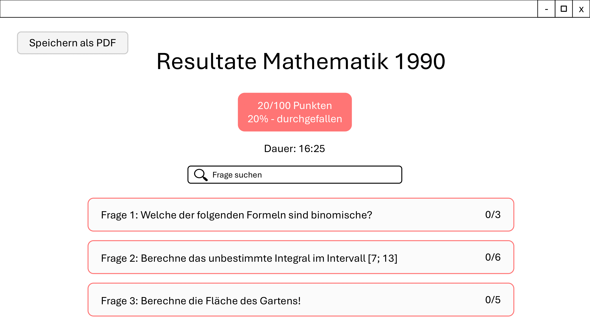
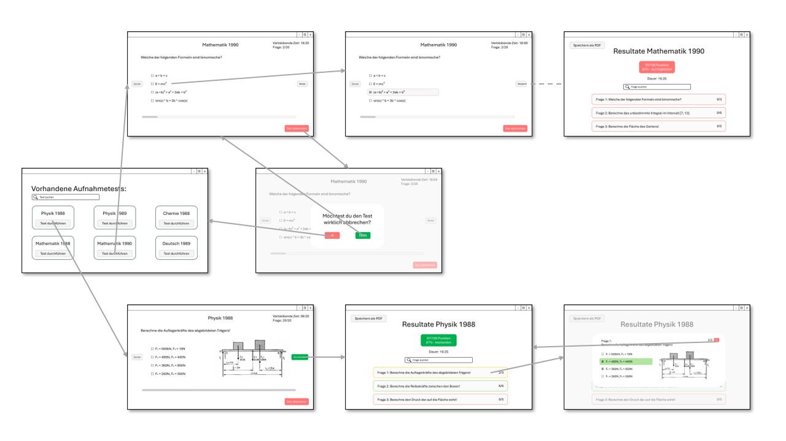

= GUI Desgin 

== Startseite

== Standart Testseite

== Testseite mit Antwort ausgewählt 

== Abbruch von dem Test

== Test beenden

== Testergebnis

== Testergebnis Antwort anschauen

== Testergebnis nicht geschafft

== Wireframe

